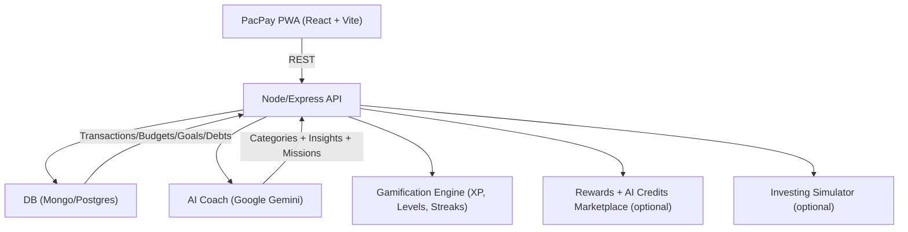

# HACKATHON_WORKFLOW

<aside>
🏆

**Hackathon:** 20-Hour Fintech Build Sprint

**Product:** **PacPay** (PWA) — Personal Finance & Budgeting + AI Financial Coach + Rewards

**Team:** Jawaan, Roshwyn, Samuel, Rajiv

</aside>

<aside>
⏱️

**Timezone:** Asia/Kolkata

**Active work:** 20 hours (within a 24-hour hackathon window)

</aside>

<aside>
🎯

**One-line pitch:** **PacPay** is a gamified money habit system that turns real spending into levels, streaks, and missions—and an AI coach that tells you *what to do next*.

</aside>

<aside>
🧠

**North-star demo moment ("wow" moment):** Import a CSV → auto-categorize spending → see budget gaps + **XP/level progress** → ask the AI coach “How can I save ₹5,000 this month?” → get 3 actions + 2 quick buttons → complete a **mission** → level up.

</aside>

---

## 🧾 Executive Summary

**Goal:** Build a usable end-to-end personal finance MVP in 20 active hours (within a 24-hour window).

- **Users can:** Register → add/import transactions → set budgets and goals → view dashboard → chat with the AI advisor.
- **Team strategy:** Parallelize by role, with timed handoffs and clear “definition of done” checkpoints.

## 🚀 MVP Scope (What we will *actually* ship)

<aside>
📱

**App format:** **PWA (PacPay)** so we can demo install-to-home-screen, fast load, and mobile-first flows.

</aside>

### Must-have

- Auth (register/login)
- Transactions CRUD + CSV import
- Spend breakdown by category (Food, Stationery, etc.)
- Budget by category (monthly)
- Dashboard summary + charts
- **Gamification:** XP + levels + streaks + missions
- **Rewards:** tokens/coins wallet (mock)
- AI: categorization + coach chat

### Nice-to-have (only if ahead)

- Debt tracking
- Leaderboard (friends)
- AI credits marketplace (level-based discounts)
- Spoof stock market learning game (investing simulator)
- Recurring transactions
- Voice input
- Scheduled insight generation
- Dark mode polish
- Demo video

## 🧩 Architecture Snapshot



<aside>
✅

**Quality bar:** Each phase ends with a working user flow, not just code merged. If something does not demo, it is not “done”.

</aside>

## 🏅 Judge-Ready Highlights (Why this can win)

- **Real user value:** Budget clarity + actionable next steps, not just “tracking”.
- **AI with purpose:** Categorization → insights → recommendations → quick actions.
- **Demo friendliness:** Clear before/after moment: “messy CSV” → “clean plan + savings actions”.
- **Credibility:** Basic privacy + reliability patterns (rate limiting, logging, fallbacks).

## 🎬 Demo Script (5 minutes)

1. **Problem (20s):** People fail because money management feels boring and unrewarding.
2. **Import (45s):** Upload CSV → auto-categorize (Food, Stationery, etc.) → instant totals.
3. **Level Up (45s):** Show XP, level, and streaks updating from real spending behavior.
4. **Missions (45s):** Start a mission (ex: “No Swiggy 3 days”) → complete step → claim tokens (mock).
5. **AI Coach (Gemini) (80s):** Ask: “How can I save ₹5,000 this month?” → 3 actions + 2 quick buttons + predicted level impact.
6. **Optional teaser (25s):** Show marketplace discount by level + investing simulator preview.
7. **Wrap (20s):** Show deployed PWA URL + what is next.

<aside>
🧪

**Prepared prompts for stage:** “Where did I overspend?”, “Give 3 savings actions”, “What will happen if I cut food by 10%?”, “How many levels faster if I save ₹500/week?”, “Show my next best mission.”

</aside>

## 🧱 Execution Plan (For the team)

| Checkpoint | By Hour | Definition of done | Owner |
| --- | --- | --- | --- |
| Flow 1: Auth → Dashboard loads | 3 | User can login and land on dashboard without errors | Jawaan + Samuel |
| Flow 2: Transactions CRUD | 6 | Add + list + filter transactions; API stable | Jawaan + Samuel |
| Flow 3: Budgets work end-to-end | 8 | Budget vs actual shows correctly; basic alerts | Roshwyn |
| Flow 4: AI categorization + advisor | 12 | Categories + advisor responses are consistent and fast | Rajiv |
| Flow 5: Deployed demo | 18 | URLs are live; happy path is smooth | All |

## 🔒 Trust, Safety, and Reliability (Short but important)

- **No sensitive data in prompts:** Send only aggregates where possible (totals, categories, ranges).
- **Rate limiting:** Protect AI endpoints to avoid surprises during demo.
- **Logging:** Store AI interactions for debugging and demo replay.
- **Fallback mode:** If AI fails, app still works (manual category + static tips).

---

## 👥 Team Distribution

| Member | Role | Primary focus | Key deliverables |
| --- | --- | --- | --- |
| **Samuel** | Frontend lead | UI, dashboard, components | Pages, components, visuals, polish |
| **Roshwyn** | Logic architect | Core algorithms, data flow | Budget engine, insights logic, scoring |
| **Jawaan** | Logic developer | API routes, DB, integrations | Auth, CRUD APIs, imports, jobs |
| **Rajiv** | AI / integration lead | Claude, prompts, automation | Advisor service, categorization, insights |

---

## 🧭 20-Hour Sprint Timeline

<aside>
🧵

**Visual timeline view (frame/lines):** This is a vertical “workflow frame” like the lines in your screenshot.

</aside>

<aside>
🧭

**20-hour workflow frame (vertical):**

● **0–3 | Phase 1: Foundation**

│ Repo + tooling setup

│ Schema + API design

│ Auth basics

│

● **3–10 | Phase 2: Core features**

│ Dashboard + transactions

│ Budget management

│ Goals + savings

│

● **10–15 | Phase 3: AI advisor**

│ Chat UI + suggested questions

│ Context endpoints + logging

│ Insights engine + quick actions

│

● **15–18 | Phase 4: Polish & integrations**

│ UX polish + responsiveness

│ Testing + bug fixes

│ Docs + deployment

│

● **18–20 | Phase 5: Demo prep**

│ Seed demo data + scenarios

│ Script + screenshots

│ Rehearsal + backup plan

│

● **Finish | Demo time**

│ Clear narrative

│ Smooth handoffs

└ Winner energy

</aside>

<aside>
🗺️

This section is also kept as a **timeline-style table** (below) so it’s easy to scan and check “definition of done”.

</aside>

| Phase | Hours | Owner(s) | What happens | Deliverables / Definition of done |
| --- | --- | --- | --- | --- |
| **Phase 1: Foundation** | 0 → 3 | All (split by role) | Setup repos, schema, auth, AI scaffolding | Repos run locally, auth works, schema + API plan drafted |
| **Phase 2: Core Features** | 3 → 10 | Parallel | Dashboard, transactions, budgets, goals | End-to-end CRUD for transactions, budget calc, goals tracking, usable UI |
| **Phase 3: AI Advisor** | 10 → 15 | Rajiv lead + team support | Chat UI, context endpoints, insights engine | Advisor answers with context, insights cards show value, logging + rate-limit done |
| **Phase 4: Polish & Integrations** | 15 → 18 | All | UX polish, testing, deployment, docs | Deployed URLs working, docs ready, core bugs fixed |
| **Phase 5: Demo Prep** | 18 → 20 | All | Seed data, script, rehearsal | Clean demo flow, backup plan prepared, team ready to present |

---

## ✅ Detailed Timeline (Tabular)

| Window | Track | Owner | Tasks (checklist) |
| --- | --- | --- | --- |
| **Hour 0–1** | Setup & architecture | All |   • [ ] Initialize React + Vite frontend repo
  • [ ] Initialize Node.js/Express backend repo
  • [ ] Setup MongoDB/PostgreSQL database
  • [ ] Create monorepo structure or separate repos
  • [ ] Setup ESLint, Prettier, Git hooks
  • [ ] Architecture diagram (Figma/Excalidraw) |
| **Hour 1–2** | Models & API design | Roshwyn + Jawaan (lead), Samuel + Rajiv (parallel) |   • [ ] Design DB schema (Users, Accounts, Transactions, Budgets, Goals, AI_Interactions)
  • [ ] Define REST endpoints
  • [ ] OpenAPI/Swagger skeleton
  • [ ] Frontend component structure + routing + base layout
  • [ ] Claude integration skeleton + prompt templates + AI service architecture |
| **Hour 2–3** | Auth | Jawaan (lead), Samuel |   • [ ] JWT auth
  • [ ] Auth middleware
  • [ ] Password hashing (bcrypt)
  • [ ] Register/login endpoints
  • [ ] Login/register pages
  • [ ] Protected route wrapper
  • [ ] Auth context |
| **Hours 3–6** | Dashboard & transactions | Samuel (FE), Roshwyn (logic), Jawaan (BE), Rajiv (AI) |   • [ ] Dashboard layout (balances, recent txns, budget progress, quick stats)
  • [ ] Transaction list + add modal + filters/search + category badges
  • [ ] Transaction service (CRUD, recurring, aggregation)
  • [ ] Budget calc engine (monthly by category, budget vs actual, alerts)
  • [ ] Transaction CRUD API + /summary endpoint
  • [ ] Budget endpoints
  • [ ] CSV import upload
  • [ ] AI auto-categorization + insights gen + spending pattern detection |
| **Hours 6–8** | Budgets | Samuel, Roshwyn, Jawaan, Rajiv |   • [ ] Budget UI (create/edit, category icons, visual progress)
  • [ ] Alerts/notifications UI
  • [ ] Budget engine improvements (rollovers, suggestions, health score, predictions)
  • [ ] Budget APIs + scheduled jobs + notification service
  • [ ] AI budget recommendations (personalized, optimization, savings opps) |
| **Hours 8–10** | Goals & savings | Samuel, Roshwyn, Jawaan, Rajiv |   • [ ] Goals dashboard + wizard + progress visuals
  • [ ] Goal tracking logic + savings calculator + priority scoring
  • [ ] Goals APIs + progress tracking endpoints
  • [ ] AI goal recommendations + savings tips |
| **Hours 10–12** | Advisor chat | Samuel + Rajiv, Roshwyn + Jawaan support |   • [ ] Chat UI (bubbles, quick actions, typing, history)
  • [ ] Suggested questions + tip cards
  • [ ] Claude advisor service + prompt building + error handling
  • [ ] Conversation memory/context mgmt
  • [ ] Context endpoint: GET /api/ai/context/:userId
  • [ ] AI interaction logging + rate limiting |
| **Hours 12–14** | Insights | Rajiv, Samuel, Roshwyn |   • [ ] Insights engine (patterns, anomalies, budget alerts, recs, health score)
  • [ ] Periodic insight generation (daily/weekly) + prioritization
  • [ ] Insights widget + cards + notification center
  • [ ] Trend calculations + data aggregation |
| **Hours 14–15** | Voice + quick actions | Rajiv + Samuel |   • [ ] Voice input (Web Speech API)
  • [ ] Quick actions (“Show my spending”, “How’s my budget?”, “Tips to save money”)
  • [ ] Buttons + keyboard shortcuts |
| **Hours 15–16** | UX polish | Samuel lead + all |   • [ ] Loading states + skeletons
  • [ ] Error boundaries + empty states
  • [ ] Animations (Framer Motion)
  • [ ] Responsive + dark mode + accessibility
  • [ ] Form validation + toasts |
| **Hours 16–17** | Testing & bug fixes | Roshwyn + Jawaan, Samuel, Rajiv |   • [ ] API testing + edge cases + validation + security checks
  • [ ] Component testing + cross-browser + mobile responsiveness
  • [ ] AI response quality + fallbacks + rate limit handling |
| **Hours 17–18** | Docs & deploy | All |   • [ ] [README.md](http://README.md)
  • [ ] API documentation
  • [ ] User guide
  • [ ] Demo video script
  • [ ] Deploy frontend (Vercel/Netlify)
  • [ ] Deploy backend (Railway/Render/[Fly.io](http://Fly.io))
  • [ ] Env vars set |
| **Hours 18–19** | Demo data & story | Jawaan, Samuel, Roshwyn, Rajiv |   • [ ] Seed realistic demo data + demo user + demo transactions
  • [ ] Walkthrough flow + screenshots
  • [ ] Metrics/stats + architecture diagram
  • [ ] AI demo scenarios + pre-generated “wow” responses + demo questions |
| **Hours 19–20** | Final rehearsal | All |   • [ ] Practice demo (2–3 runs)
  • [ ] Assign speaker roles
  • [ ] Backup plan if live demo fails
  • [ ] Final pass on slides
  • [ ] Team huddle |

---

## 🗂️ Notion Workspace Structure (Tabular)

| Area | What to create | What it contains |
| --- | --- | --- |
| 📊 Project dashboard | One page | Sprint overview, team roles, timeline, progress tracker |
| 📝 Tasks database | Database | Task, assignee, status, priority, due, phase |
| 🎨 Design system | Docs page | Components, palette, typography, icons |
| 🔧 Technical docs | Docs page | Architecture, API docs, schema, AI prompts |
| 📅 Sprint boards | Board views | One per phase (Foundation → Demo prep) |
| 🚀 Demo materials | Demo page | Slides, script, screenshots, video |

---

## 🛠️ Tech Stack (Cheat Sheet)

<aside>
🧩

**PacPay PWA basics to include:** Web App Manifest, service worker (offline shell), install prompt, responsive layout.

</aside>

| Layer | Owner | Key libraries |
| --- | --- | --- |
| Frontend | Samuel | React, React Router, Tailwind, Recharts, Framer Motion, React Query, Axios, Zustand |
| Backend | Roshwyn + Jawaan | Express, Mongoose, JWT, bcrypt, dotenv, node-cron, csv-parser, cors |
| AI | Rajiv | Anthropic SDK, LangChain, Zod |

---

## 🤖 AI Prompts Library

- Transaction categorization
    
    ```
    System: You are a financial categorization assistant. Categorize the following transaction into one of these categories: Food, Transport, Shopping, Bills, Entertainment, Health, Education, Travel, Other.
    
    User: Transaction: "{description}", Amount: ${amount}
    
    Response format: {"category": "category_name", "confidence": 0-1}
    ```
    
- Financial advice
    
    ```
    System: You are a helpful personal finance advisor. Provide concise, actionable advice based on the user's financial data.
    
    Context:
    - Monthly Income: ${income}
    - Total Expenses: ${expenses}
    - Top Categories: ${topCategories}
    - Budget Status: ${budgetStatus}
    - Active Goals: ${goals}
    
    User: {query}
    
    Provide specific, personalized advice in 2-3 sentences.
    ```
    
- Spending insights
    
    ```
    System: Analyze the following spending data and provide 3 key insights with actionable recommendations.
    
    Data:
    ${transactions}
    
    Format each insight as:
    - Insight: [observation]
    - Impact: [financial impact]
    - Action: [specific recommendation]
    ```
    

---

## ✅ Success Metrics

| Metric | Status |
| --- | --- |
| User can register/login |   • [ ] |
| User can add/view transactions |   • [ ] |
| Budget tracking works |   • [ ] |
| Goals can be created and tracked |   • [ ] |
| AI Advisor responds to queries |   • [ ] |
| Dashboard shows key metrics |   • [ ] |
| App deployed and accessible |   • [ ] |
| Demo is smooth and impressive |   • [ ] |

---

## 🚨 Risk Mitigation

| Risk | Mitigation |
| --- | --- |
| AI API downtime | Fallback to cached responses. Graceful degradation. |
| Database issues | Use local storage as backup. Connection pooling. |
| Demo failure | Pre-recorded demo video. Screenshots. |
| Time overrun | Cut nice-to-have features. Focus on core. |
| Team sync issues | Regular check-ins. Shared dashboard. |

---

---

## 🏁 Final Checklist (Before Demo)

- [ ]  All team members have tested their components
- [ ]  Demo data is realistic and impressive
- [ ]  AI responses are tested and working
- [ ]  Deployment URLs are accessible
- [ ]  Presentation is ready
- [ ]  Backup demo video recorded
- [ ]  Team knows their speaking parts