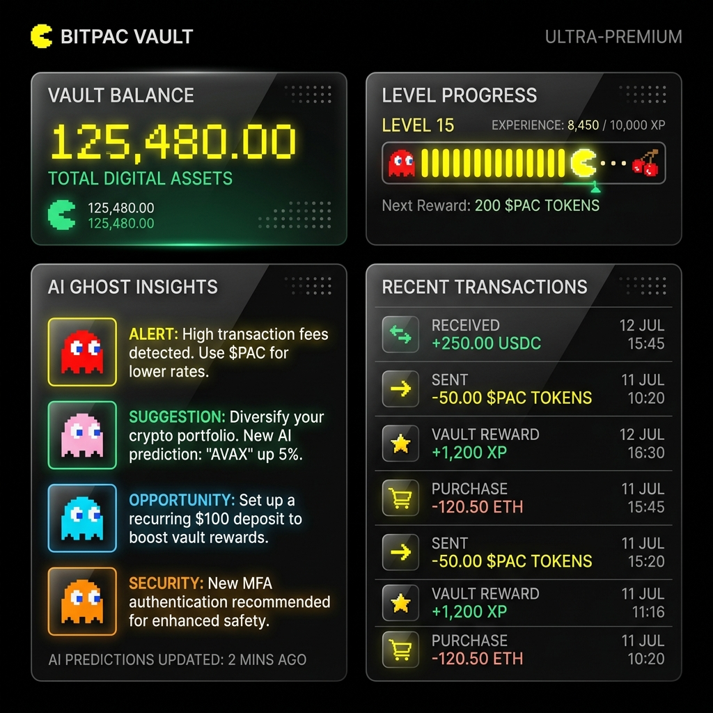
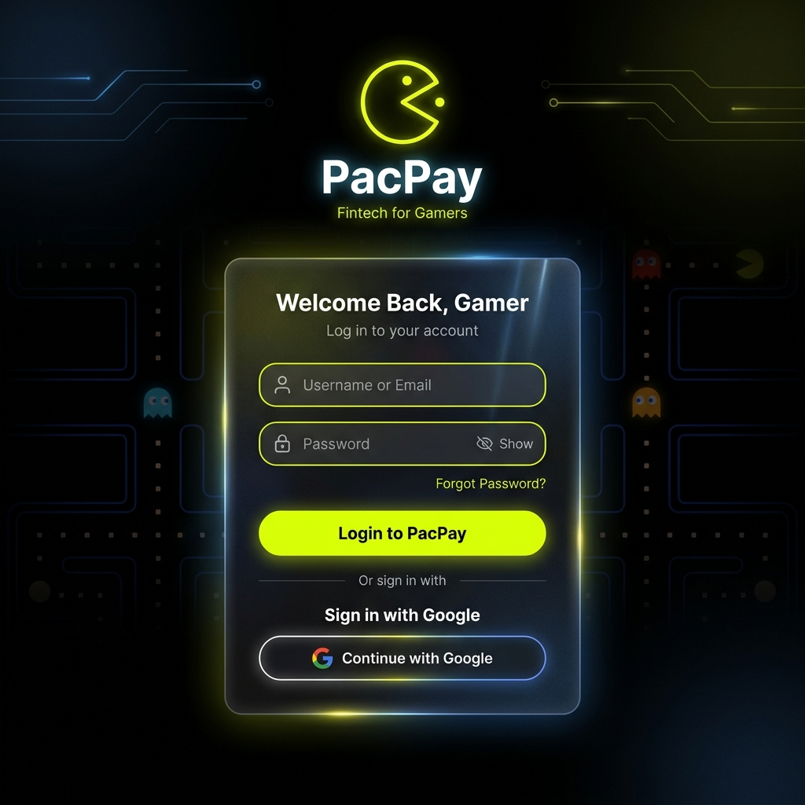

# 🕹️ PacPay: The Premium Arcade Fintech Platform



Welcome to **PacPay**! A highly ambitious Hackathon project built to transform personal finance from a tedious chore into an engaging, dynamic, and visually stunning interactive experience. Influenced seamlessly by retro-arcade culture, PacPay combines Next.js architecture with cutting-edge UI frameworks to deliver a secure, lightning-fast banking companion.

---

## 🌟 Key Features

PacPay merges state-of-the-art fintech tooling with seamless gaming design language to encourage healthier spending habits.

- **🎨 Ultra-Premium Arcade Aesthetic:** A stunning dark-mode interface featuring neon yellow/emerald accents, beautiful glassmorphism paneling, and smooth Framer Motion micro-animations.
- **🔐 Secure Authentication:** Enterprise-tier authentication powered by Firebase. Includes fully functional Google Sign-In, Email/Password flows, and ironclad active route guarding.
- **📈 Arcade-Style Financial Tracking:** Track your wealth just like you're tracking an arcade high score. Features live Vault Balances, dynamic Level Progress mapping, and Weekly Spend analytics.
- **👻 AI "Ghost" Insights:** Smart, context-aware artificial intelligence tips that quietly analyze your transactions and offer saving guidance in real-time.
- **💳 Live Payment Gateways:** Immediate Razorpay integration ensuring your virtual wallet remains effortlessly topped up.
- **⚡ Next.js 16 Edge Performance:** Capitalizing on the absolute latest Next.js 16 App Router improvements, ensuring zero-latency transitions and flawless mobile-first responsiveness.
- **📱 PWA (Progressive Web App):** Install PacPay directly to your phone for a completely native, polished application experience.

---

## 📸 Platform Gallery

### The Dashboard
View your Vault Balance, Arcade Rank, and AI insights all from one seamlessly integrated, real-time dashboard.


### Secure Authentication
A flawlessly animated, intuitive login hub tailored for returning players and newcomers alike.



---

## 🚀 Getting Started

To run the platform locally on your own machine:

1. Clone this repository directly.
2. Ensure you have the latest Node environment active.
3. Install dependencies:
   ```bash
   npm install
   ```
4. Set up your `.env.local` to match the given `firebaseConfig` properties, as well as your `NEXT_PUBLIC_RAZORPAY_KEY_ID`.
5. Run the bleeding-edge Next.js development server:
   ```bash
   npm run dev
   ```
6. Navigate to `http://localhost:3000` to dive into the arcade!

---

**Built passionately for SummerHacks 2026** ✨
